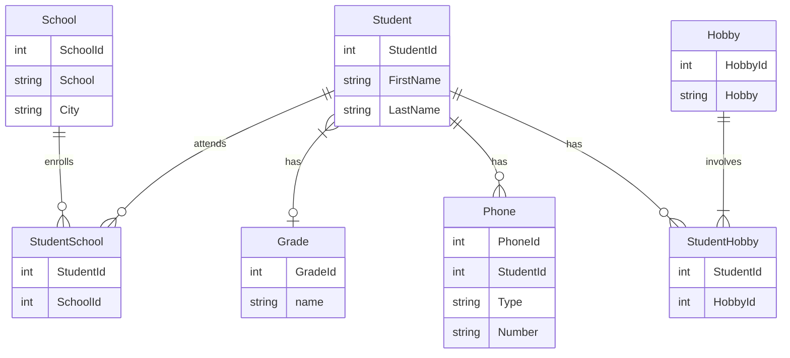

# db2022

#Entity Relationship Diagram

```mermaid
erDiagram
    School||--o{ StudentSchool : enrolls
    School {
    int SchoolId
    string School
    string City
    }
    
    Student||--o{ StudentSchool : attends
    Student {
    int StudentId
    string FirstName
    string LastName
    }
    StudentSchool  {
    int StudentId
    int SchoolId
    }
    
    Student }|--o| Grade : has
    
    Grade {
        int GradeId
        string name
    }
    
    
     Student||--o{ Phone : has
    Phone{
    int PhoneId
    int StudentId
    string Type
    string Number
    }
    
    Student||--o{ StudentHobby : has
    
    Hobby||--|{ StudentHobby : involves
    StudentHobby{
    int StudentId
    int HobbyId
    }
    Hobby{
    int HobbyId
    string Hobby
    }
   
```
